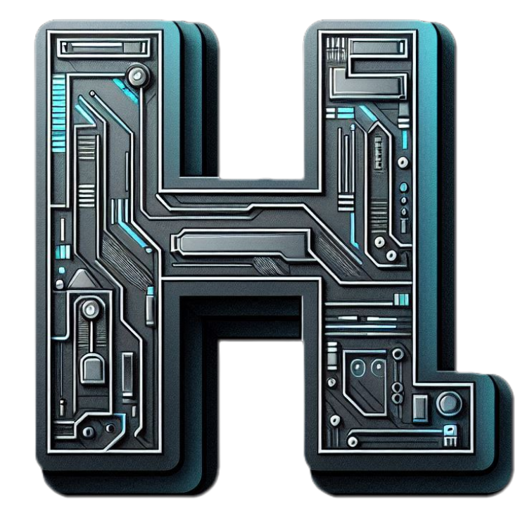

# Hector M. Lopez

**Backend Engineer** | Python | Go | Rust | TypeScript

Backend engineer interested in developer tooling, APIs, and databases. I try to write code that's easy to understand and maintain.

---

## Featured Projects

| Project                                                          | Description                                                | Tech       |
| ---------------------------------------------------------------- | ---------------------------------------------------------- | ---------- |
| [astroladb](https://github.com/hlop3z/astroladb)                 | Schema-first migrations. Write once, export everywhere.    | Go         |
| [spoc](https://github.com/hlop3z/spoc)                           | Meta-framework for building extensible Python applications | Python     |
| [dinja](https://github.com/hlop3z/dinja)                         | MDX rendering powered by Rust                              | Rust       |
| [coding-algorithms](https://github.com/hlop3z/coding-algorithms) | Algorithm implementations and coding notes                 | TypeScript |

---

## Tech Stack

---

## Connect

---

<a href="https://hlop3z.github.io/portfolio">                                                                                                                              
    
</a>

